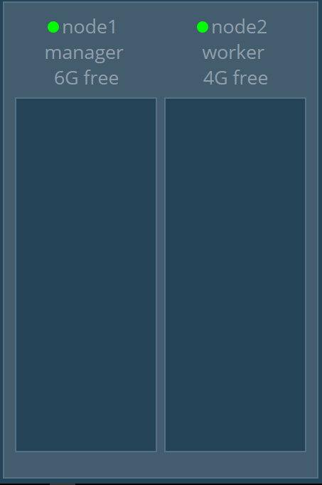

**User story**
- As a DevOps team member I want to automate setting up of a set of nodes for development purpose so that I can distribute Docker Swarm services in a cluster configuration.

  

**Assumptions**
- Infrastucture being setup is _'ubuntu/xenial64'_ based

**Instructions:**
- Clone this repo
-	Change to the directory where code is cloned to
-	Change to the technology directory you would like to use in order to stand up infrastructure _(only vagrant at this moment)_
