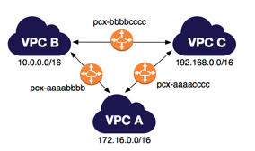
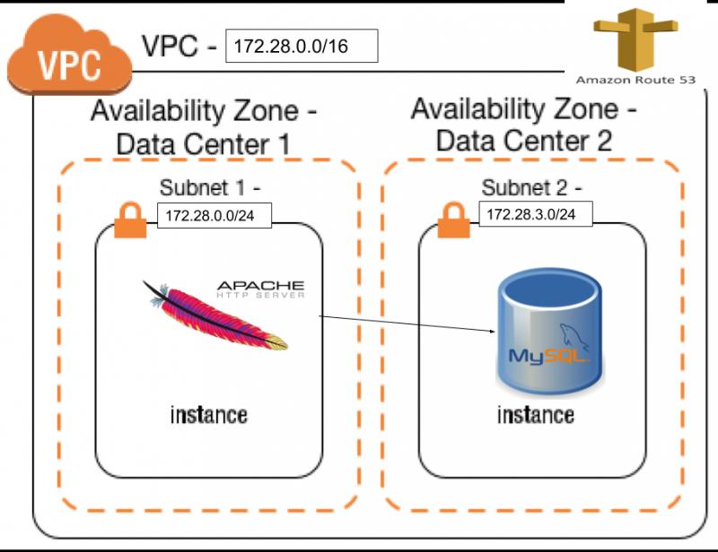

### multi-env
- _(Work in Progress)_

This example assumes terraform can be executed natively on your platform.

  

Infrastructure created with terraform makes use of modules to spin up multiple environment. Each environment is in its own VPC. Communication between all environments is via VPC peering.
- Environment `logging` is reserved for setting up Elastic Stack where application logs are aggregated. Elastic will also be used for monitoring all environments within multi-env example
- Environment `common` is reserved for setting up a SSO / Authentication & Authorization componennt
- Environment `devops` is reserved for setting up Continuous Integration tools i.e. Jenkins, GitLab, etc.

### two-tiers
- _(Work in Progress)_

For the purpose of learning Terraform, the idea for this repository was taken from the Linux Academy: https://linuxacademy.com/howtoguides/posts/show/topic/13922-a-complete-aws-environment-with-terraform

This example uses docker to execute terraform. Infrastructure created by terraform reflects _([AWS Scenario 2](http://docs.aws.amazon.com/AmazonVPC/latest/UserGuide/VPC_Scenario2.html))_

If docker can not run natively on your platform, a Vagrantfile is provided that may be used to create a VM which will have docker installed.

  

